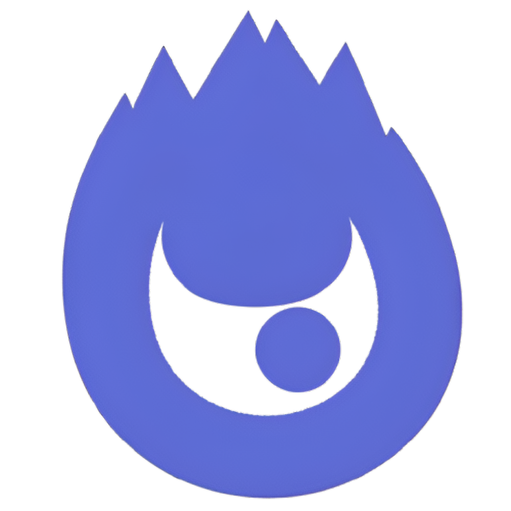
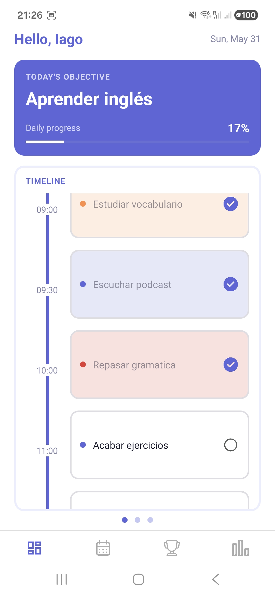
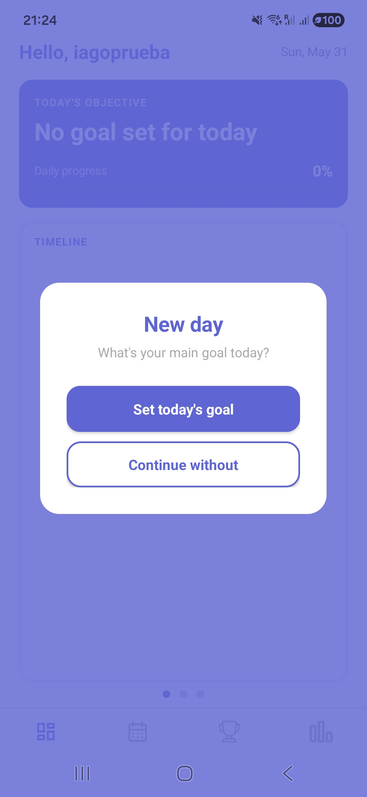
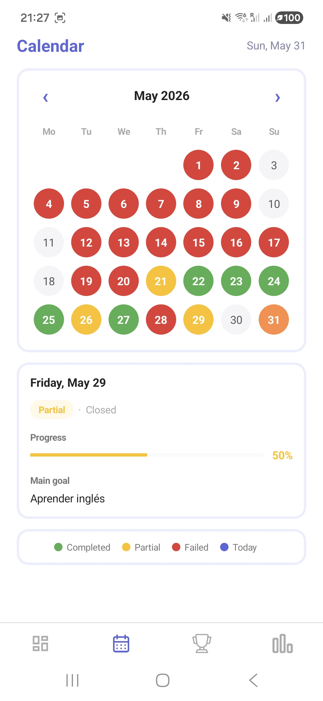
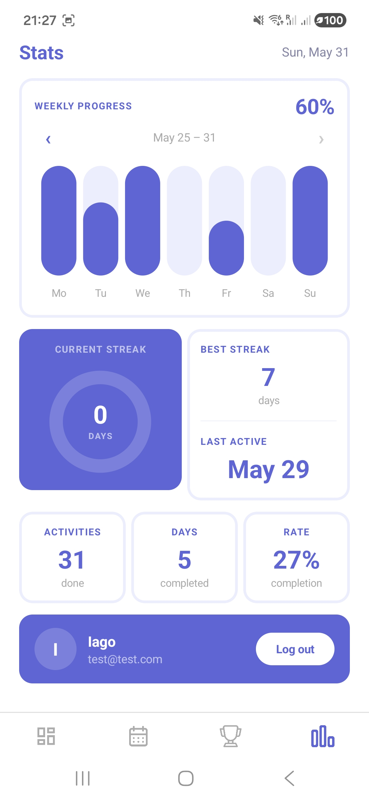
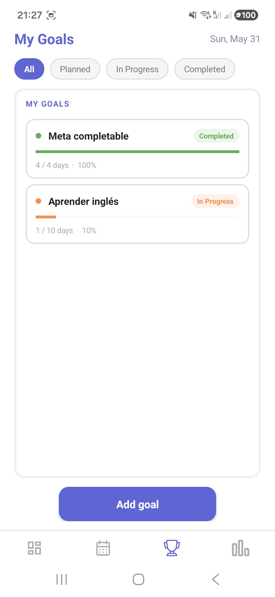

# OneDay


---

## Índice
- [Descripción](#descripción)
- [Funcionalidades](#funcionalidades)
- [Tecnologías](#tecnologías)
- [Instalación](#instalación)
- [Autor](#autor)

---

## Descripción

**OneDay** es una app de productividad personal basada en una idea simple: cada día tiene **un objetivo principal**.

En lugar de listas interminables de tareas, OneDay te invita a decidir cada mañana qué es lo más importante y construir tu día alrededor de eso. Las tareas secundarias existen, pero siempre en segundo plano.



---

## Funcionalidades

- ### Objetivo del día


Cada día empieza eligiendo tu meta principal. Puedes asignarla desde tus objetivos activos y visualizar el progreso directamente en la pantalla de inicio.

<br/>

- ### Calendario


Visualiza tu historial mensual con un código de colores por estado: completado, parcial o fallido. Toca cualquier día para ver el detalle de lo que hiciste.

<br/>

- ### Estadísticas


Consulta tu racha actual, el mejor récord, el progreso semanal con gráficas de barras y un resumen de actividades completadas.

<br/>

- ### Objetivos a largo plazo


Gestiona metas de varios días con seguimiento automático de progreso. Los días completados o parciales cuentan; los fallidos no penalizan.

---

## Tecnologías

- **Backend:** Python, Django, SQLite
- **Frontend:** Android (Java), Retrofit2, Material Design
- **Auth:** Token personalizado (sin librerías externas)
- **API:** REST con `JsonResponse` y vistas manuales

---

## Instalación

**Backend:**
```bash
cd od_backend
python manage.py migrate
python manage.py runserver
```

**Frontend:**  
Abre `od_frontend/` en Android Studio y ejecuta en un emulador o dispositivo físico.  
Asegúrate de que la IP en `ApiClient.java` apunta a tu máquina.

---

## Autor

- [Iago Donsión Fernández](https://github.com/iagodf)
